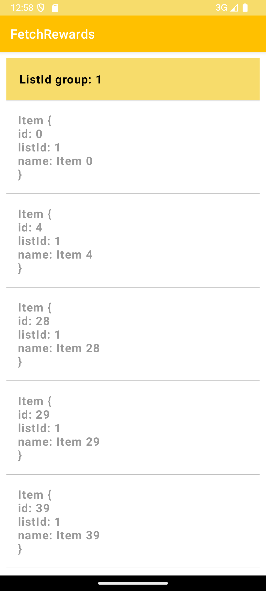
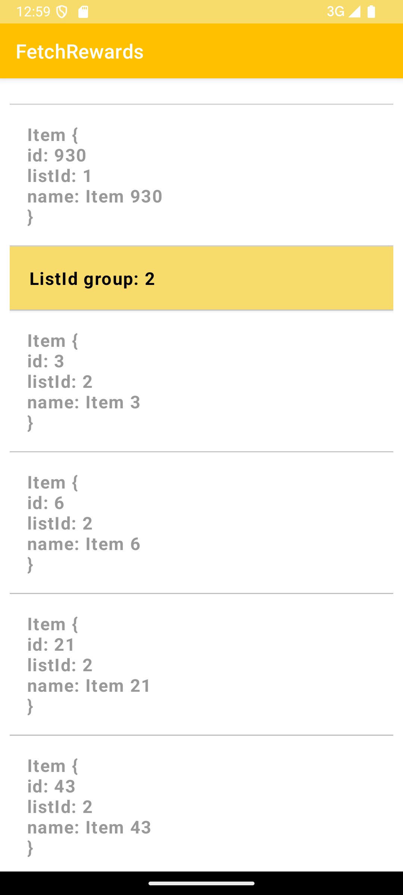

# Fetch-Rewards-Coding-Exercise

## Overview
The Fetch Rewards Coding Exercise is an Android app designed to fetch JSON data from a specified URL, parse the data, and display it in a ListView. The app is built using Java and follows best practices for Android development.

## Features
- Fetches JSON data from a remote server
- Parses JSON data and validates entries
- Displays data in a ListView with section headers

## Installation
1. Clone the repository:
    
    git clone https://github.com/isabear-yu/Fetch-Rewards-Coding-Exercise.git
    
2. Open the project in Android Studio.
3. Build the project to download dependencies and set up the environment.

## Usage
1. Run the application on an Android device or emulator.
2. The app will automatically fetch and display the data from the specified URL.

## Code Structure
- MainActivity.java: The main entry point of the application. Handles fetching, parsing, and displaying data.
- SectionListAdapter.java: Custom adapter for displaying items and headers in a ListView.
- Item.java: Model class representing an item with an ID, list ID, and item number.

## Screenshots

